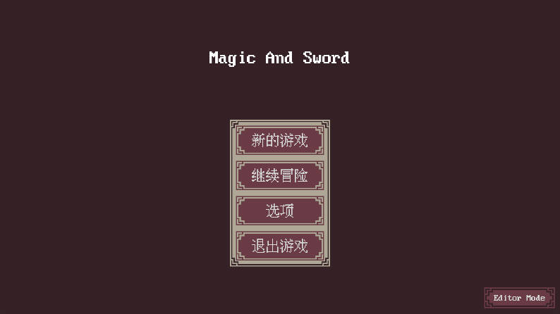
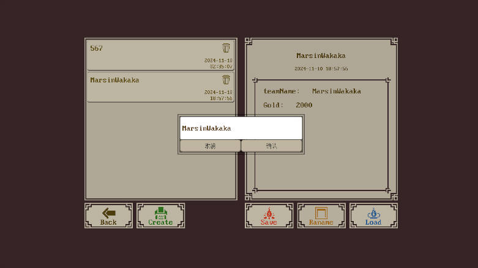
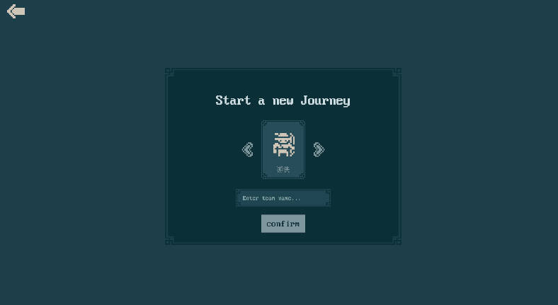
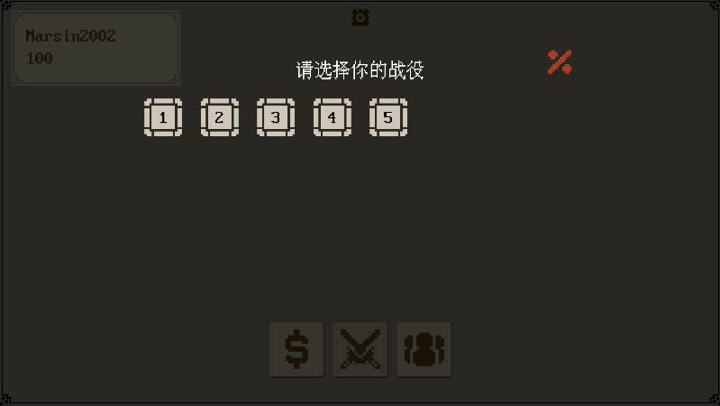
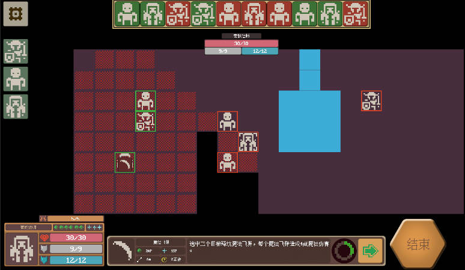

# 项目介绍

该项目是目前来说最令我满意的了，我仍然能记得因为战旗怪物AI发愁的日子，日思夜想，那段时间我收获了很多。现在AI是弱化版，计算量少了很多的同时，决策也不是全局最优的（这个计算量太大了），后续会给AI添加更多的决策行为逻辑。AI的决策基于寻路导航和攻击视野，以及场上角色的站位。

***

### 背景

该项目代码规范程度以及模块设计能力相较于前几个项目有了极大地的提升，该战旗游戏由之前的一个战旗Demo迭代过来，项目保留了原来的代码(Obsolete命名空间下)。

***

### 项目实践介绍。

- 基于战场感知信息决策的AI，实现了战旗的人机战斗
- 使用事件中心负责不同模块间的通信，服务定位器管理游戏模块功能。
- 使用自定义关卡文件格式，关卡管理器通过编写的解析器从中磁盘中读取关卡数据并交由实体工厂生成。
- 使用状态模式来制作角色控制器，控制选中角色的行为逻辑切换（闲置，移动，技能选择，技能释放等)
- 基于避障BFS的移动范围显示。

***

**[游戏展示]**

- 游戏界面

- 部署演示图

- AI站位决策

- 玩家攻击

- 战斗画面

